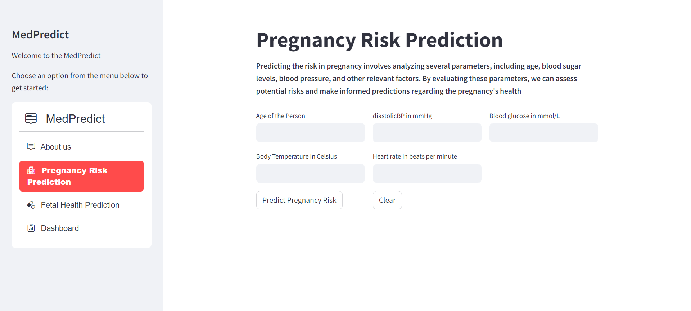
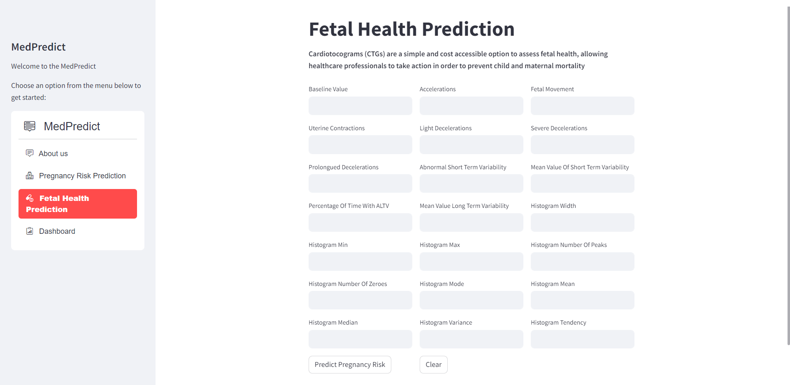

# MaternalInsight - Advanced Maternal and Fetal Health Prediction Platform

## Introduction

Welcome to Maternal Insight, a pioneering platform designed to enhance maternal and fetal health through advanced predictive analytics. MaternaInsight equips healthcare professionals and users with accurate predictions and proactive risk management tools for pregnancy-related health concerns.

### Webapp URL
Maternal Insight: [MaternaL Insight link](https://evubq2jtxs2sggostxqgem.streamlit.app/)

## Key Features

- **Pregnancy Risk Prediction:** Our Pregnancy Risk Prediction feature utilizes advanced algorithms to analyze various parameters, including age, body sugar levels, blood pressure, and more. By processing this information, we provide accurate predictions of potential risks during pregnancy.

- **Fetal Health Prediction:** Cardiotocograms (CTGs) are a simple and cost accessible option to assess fetal health, allowing healthcare professionals to take action in order to prevent child and maternal mortality

- **Dashboard:** Our Dashboard provides a user-friendly interface for monitoring and managing health data. It offers a holistic view of predictive analyses, allowing healthcare professionals and users to make informed decisions. The Dashboard is designed for ease of use and accessibility.

<p align="center">
     

</p>

<p align="center">
     

</p>

## How to Run the Streamlit Code

Follow these steps to run the Streamlit code locally:

### Clone the Repository

```bash
git clone https://github.com/your-username/medpredict.git
cd medpredict
```
### Install Dependencies
 ```bash
 pip install -r requirements.txt
 ```
 ### Run the Streamlit App
 ```bash
streamlit run main.py
```
This will launch the Streamlit app locally. Open your web browser and navigate to the provided local address to explore MedPredict.
